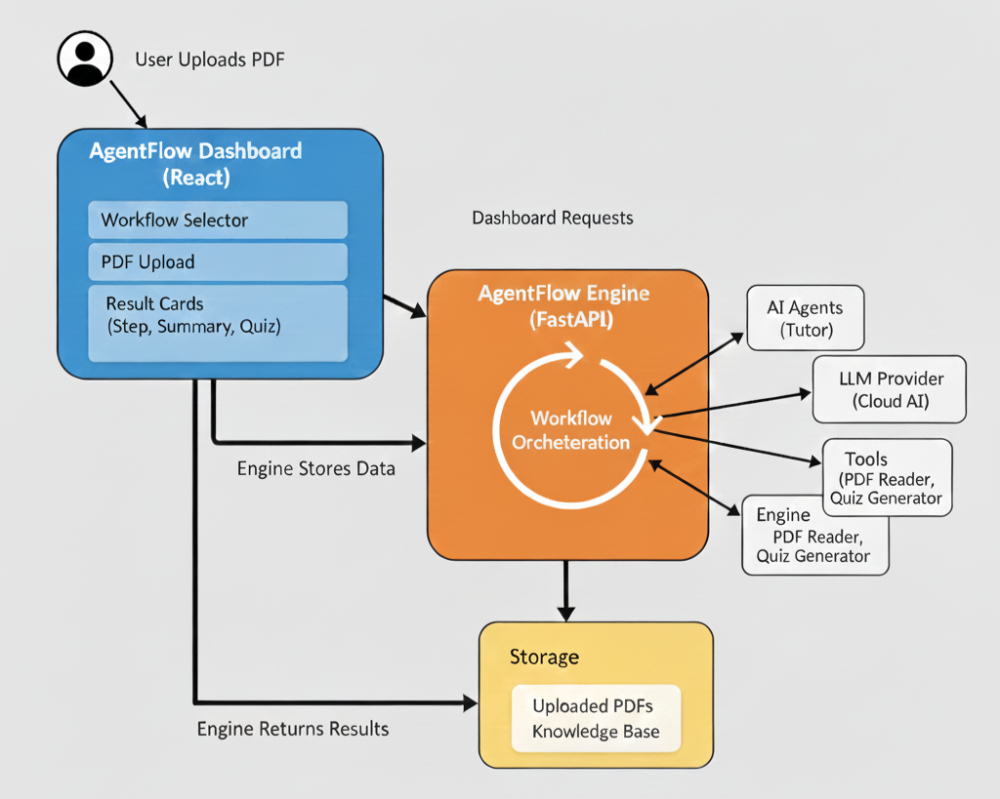

# AgentFlow Engine - Backend


AgentFlow automates the transformation of raw educational material into structured learning assets. Instead of manually reading and creating quizzes, this engine processes PDFs to automatically generate **summaries** and **multiple-choice quizzes**.

## Architecture Diagram



**How it Works**
The system is an intelligent workflow engine powered by LLMs:
1.  **Ingest**: Uses `pdf_reader` tools to extract text from uploaded documents.
2.  **Orchestrate**: Follows YAML-defined workflows (e.g., `extract -> summarize -> quiz`) to chain tasks together.
3.  **Generate**: specialized Agents (like the Tutor Agent) use OpenAI to synthesize content and create assessments.

**Quick Start**

1.  **Install Dependencies**
    ```bash
    pip install -r requirements.txt
    ```

2.  **Configure Secrets**
    Create a `.env` file:
    ```
    OPENAI_API_KEY=sk-...
    ```

3.  **Run Server**
    ```bash
    uvicorn app.main:app --reload
    ```

**Core Endpoints**
*   **Discovery**: `GET /workflows` - See available automation pipelines.
*   **Ingestion**: `POST /upload-pdf` - Upload a lesson PDF.
*   **Execution**: `POST /run-workflow` - Trigger the AI pipeline.

Interactive documentation available at: `http://localhost:8000/docs`